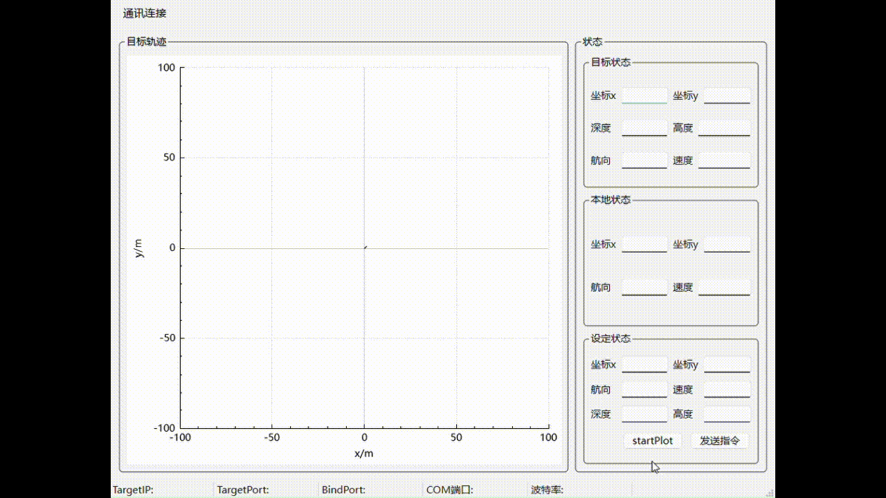

## Dependence
Qt6
## Communicaton
UDP, COM
## Build System
qmake
## Annotation
程序创建了三个线程，分别是主窗口(mainwindow)、udp通信(udpthread)、串口通信(serialthread)，线程间通过信号和槽机制传输数据。 
动态轨迹绘制通过CustomPlotWidget.addpoint(Point &point)实现。  

